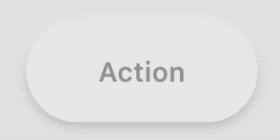

# ＳＵＲＦＡＣＥ [](#)

**Neumorphic** shadow example:

```swift

let view = SurfaceView()
view.frame = ...
view.cornerRadius = ...
view.shadowLayer.shadow = Shadow(preset: .convex1)
view.shadowLayer.useDeviceMotionToCastShadow = true
addSubview(view)
```

The cast shadows moves accordingly to the device horizontal axis.


