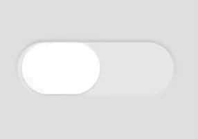

# Surface [](#)

**Neumorphic** shadow example:

```swift
let view = SurfaceView()
view.frame = ...
view.layer.cornerRadius = ...
view.surfaceLayer.shadow = Shadow(preset: .convex1)
view.surfaceLayer.useDeviceMotionToCastShadow = true
addSubview(view)
```

The cast shadows moves accordingly to the device horizontal axis.


**Convex/Concave** shadow example:


```swift
view.backgroundColor = systemBackground()
let surface = SurfaceView()
surface.frame = CGRect(x: 100, y: 100, width: 96, height: 32)
surface.layer.cornerRadius = 16
surface.surfaceLayer.shadow = Shadow(preset: .concave2)
view.addSubview(surface)

let button = SurfaceView()
button.frame = CGRect(x: 0, y: 0, width: 48, height: 32)
button.layer.cornerRadius = 16
button.surfaceLayer.shadow = Shadow(preset: .convex1)
button.backgroundColor = .white
surface.addSubview(button)
```


